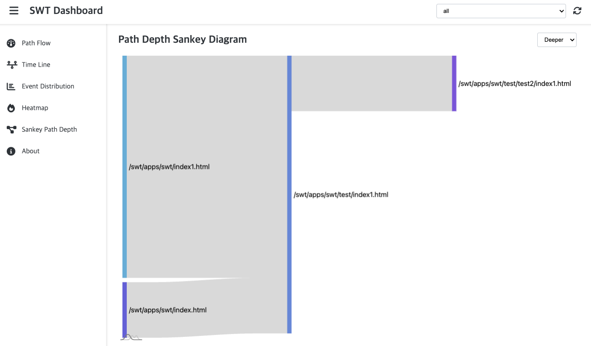

# SWT (Simple Web Tracker)


SWT (Simple Web Tracker) is a lightweight JavaScript library designed for tracking user interactions and events on web pages. It provides functionalities to log various user activities, manage sessions, and visualize data through a built-in dashboard.

## Features

*   **Event Tracking**: Tracks clicks, mouse movements, scrolls, page loads, and URL changes.
*   **Session Management**: Automatically manages user sessions, allowing for new session creation and retrieval of session data.
*   **Configurable**: Easily configure tracking behavior via HTML `data-*` attributes.
*   **Dashboard**: A built-in dashboard for visualizing collected session data, including path flow, event distribution, and heatmaps.
*   **Data Export**: Export collected data to CSV format from the dashboard.

## Installation

To use SWT, include the `dist/index.js` script in your HTML. You can configure SWT using `data-swt-*` attributes on the script tag.
``
```html
<script
    id="swt"
    data-swt-target-query-selector="a, img, div.wow"
    data-swt-post-url="http://your-backend-url.com/track"
    data-swt-post-buffer-time="5000"
    data-swt-token="your-auth-token"
    data-swt-open-dashboard-delay="0"
    type="module" src="https://cdn.jsdelivr.net/npm/@dooboostore/swt/dist/index.min.js"
></script>
```

### Dynamic Script Insertion (for CDN usage)

You can also dynamically insert the SWT script from a CDN into your page. This is useful for external sites or when you prefer not to host the script directly.

```javascript
const script = document.createElement('script');
script.id = 'swt';
script.type = 'module';
script.setAttribute('data-swt-target-query-selector', '#portal, #scriptHolder, #home_banner, #viewport-box');
script.src = 'https://cdn.jsdelivr.net/npm/@dooboostore/swt/dist/index.min.js';
document.head.appendChild(script);
```

## Configuration Options

These options are set as `data-swt-*` attributes on the `<script id="swt">` tag:

*   `data-swt-target-query-selector` (Optional, `string`): A comma-separated list of CSS selectors for elements you want to specifically track clicks, visibility, and binding events on. Example: `"a, img, .trackable-div"`.
*   `data-swt-post-url` (Optional, `string`): The URL where collected log data will be sent via `POST` requests. If not provided, data will only be stored in `sessionStorage`.
*   `data-swt-post-buffer-time` (Optional, `number`): The time in milliseconds to buffer collected events before sending them to the `post-url`. Defaults to `0` (no buffering).
*   `data-swt-token` (Optional, `string`): An authentication token to be included in the `Authorization` header when sending data to the `post-url`.
*   `data-swt-open-dashboard-delay` (Optional, `number`): Delay in milliseconds before the dashboard script is loaded when `swt.openDashboard()` is called. Defaults to `0`.
*   `data-swt-disabled-auto-start` (Optional, `boolean`): If present, SWT will not automatically start tracking on `DOMContentLoaded`. You will need to manually call `window.swt.run()`.
*   `data-swt-mode` (Optional, `string`): Set to `"dashboard"` when the script is loaded within the SWT dashboard window. This changes the script's behavior to run the dashboard application instead of the tracker.

## Usage

Once the script is included, the `swt` instance will be available globally on the `window` object (i.e., `window.swt`).

### Available Methods

You can interact with the `swt` instance directly from your browser's developer console or your JavaScript code.

*   `window.swt.run()`: Initializes the tracker. This is automatically called on `DOMContentLoaded` unless `data-swt-disabled-auto-start` is set.
*   `window.swt.help()`: Displays a help message in the console with available methods.
*   `window.swt.status()`: Returns the current session status and a list of past sessions.
*   `window.swt.showSession()`: Displays the ID of the current active session in the console.
*   `window.swt.newSession(options?: { id?: string, data?: object })`: Creates a new session. You can optionally provide a `sessionId` and additional `data` for the session. If `id` is not provided, a random UUID is generated.
*   `window.swt.openDashboard()`: Opens a new browser window displaying the SWT Dashboard, which visualizes the collected session data.

### Example

```javascript
// Check the current status
console.log(window.swt.status());

// Create a new session with custom data
window.swt.newSession({ data: { user: 'john.doe', campaign: 'summer_sale' } });

// Open the dashboard
window.swt.openDashboard();
```

## Dashboard

The SWT Dashboard provides a visual interface to analyze the collected tracking data. It can be opened by calling `window.swt.openDashboard()` from the tracked page.

The dashboard includes:

*   **Path Flow**: Visualizes user navigation paths between different pages.
    

*   **Time Line**: Shows events over time for each session.
    

*   **Event Distribution**: Displays the distribution of different event types across pages.
    

*   **Heatmap**: Provides a heatmap of element interactions (clicks, visibility, etc.) on pages.
    

*   **Sankey Path Depth**: Visualizes path depth changes using a Sankey diagram.
    

*   **Error Log**: Tracks and displays JavaScript errors (`error`) and unhandled promise rejections (`unhandledrejection`) grouped by page.
    

*   **Session Replay**: Replays user sessions visually on a canvas, showing mouse movements, clicks, scroll positions, and element states over time.
    

*   **Session Filter**: Allows filtering sessions based on various criteria.
    


## Development

For development and building the project, refer to the `package.json` scripts.

```bash
pnpm run bundle

pnpm run test
```

## License

This project is licensed under the MIT License. See the `LICENSE.md` file for details.